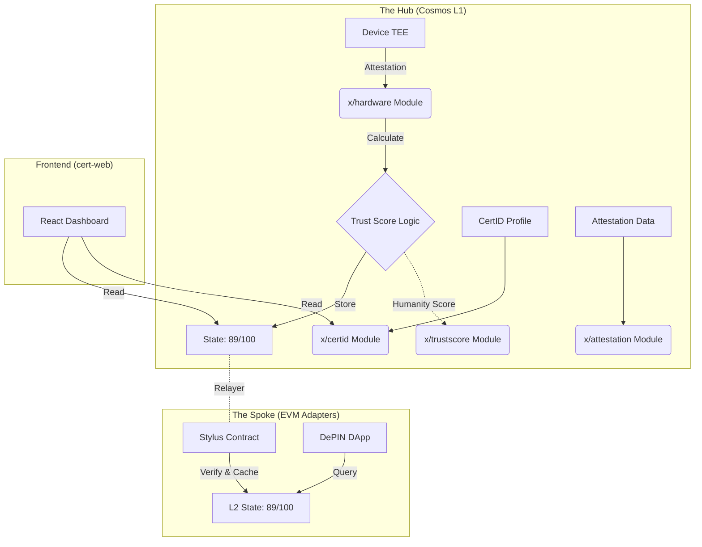

# CERT Blockchain — Sovereign L1 Protocol

The Hub of the CERT Ecosystem: a Cosmos SDK L1 blockchain with EVM compatibility, providing hardware-anchored identity, deterministic trust scoring, and decentralized attestations.

## Architecture



## Modules

| Module | Path | Description |
|--------|------|-------------|
| **hardware** | `x/hardware/` | Device registration, TEE attestation verification, DePIN device trust scoring |
| **trustscore** | `x/trustscore/` | Humanity Score calculation, Sybil resistance, anti-bot scoring |
| **certid** | `x/certid/` | Decentralized Identity (DID) profiles, credential management |
| **attestation** | `x/attestation/` | On-chain attestation creation, EAS-compatible schemas |

## Project Structure

```
cert-blockchain/
├── cmd/certd/          # Chain binary (certd daemon)
├── app/                # Module wiring and BaseApp configuration
├── x/                  # Cosmos SDK Modules
│   ├── hardware/       # Device & TEE Logic
│   ├── trustscore/     # Humanity Scoring Logic
│   ├── certid/         # DID Identity Logic
│   └── attestation/    # Attestation Logic
├── proto/              # Protobuf Definitions
│   └── cert/
│       ├── hardware/   # Device & attestation protos
│       ├── trustscore/ # Scoring protos
│       └── certid/     # Identity protos
├── contracts/          # Solidity smart contracts (CertID, EAS)
├── sdk/                # JavaScript/TypeScript SDK
├── api/                # REST API server
└── docs/               # Documentation & Whitepaper
```

## Related Repositories

| Repository | Purpose |
|------------|---------|
| [certid-evm-adapters](https://github.com/chaincert/certid-evm-adapters) | Arbitrum Stylus verifier, Optimism bridge, Attestation API |
| cert-web | React frontend dashboard (separate deployment) |

## Build

```bash
# Build the certd binary
make build

# Install to $GOPATH/bin
make install

# Run unit tests
make test-unit

# Run all tests
make test
```

## Chain Configuration

| Parameter | Value |
|-----------|-------|
| Chain ID | `cert_8888-1` |
| EVM Chain ID | `8888` |
| Bond Denom | `ucert` |
| Bech32 Prefix | `cert` |
| JSON-RPC | `http://localhost:8545` |
| CometBFT RPC | `http://localhost:26657` |

## Quick Start

```bash
# Start the node with EVM JSON-RPC enabled
make start
```

## License

See [LICENSE](LICENSE) for details.
