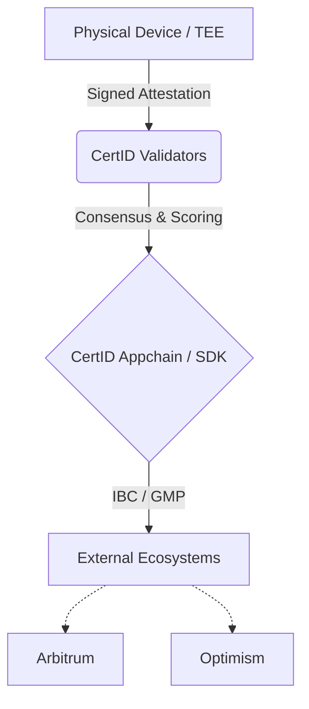

# CertID Blockchain (Layer 1)

   

**The Sovereign Identity Layer for the Decentralized Physical Economy (DePIN).**

CertID is a specialized Layer 1 blockchain built on the **Cosmos SDK**. It serves as the root of trust for hardware-anchored identities, bridging the gap between physical devices (TEEs) and on-chain reputation.

> **Note:** This is the complete monorepo for the CertID Layer 1 protocol.

---

## 📂 Repository Structure

This repository is organized as a monorepo to house the complete blockchain suite:

```text
├── sdk/                # CORE: The Cosmos SDK Application & Consensus Logic
│   ├── x/identity      # Module: DID Management & Hardware Anchoring
│   ├── x/trustscore    # Module: Reputation Scoring Logic
│   ├── cmd/            # Binary Entrypoints (certd)
│   └── app/            # App Wiring & Keeper Setup
├── docs/               # Protocol Specification & Architecture
└── scripts/            # Local Testnet & Initialization Scripts
```
## 🏗 Architecture

CertID operates as a **Sovereign** Hub that handles heavy compute (signature verification, trust scoring) off-chain via Trusted Execution Environments (TEEs) and finalizes the state on-chain.
Code snippet



## 🚀 Getting Started
**Prerequisites**
-   **Go:** `1.21+`

-  **Make:** Standard build tools

**Installation**

The core application logic resides in the `sdk` directory.
Bash

```
# Clone the repository
git clone [https://github.com/chaincert/cert-blockchain.git](https://github.com/chaincert/cert-blockchain.git)
cd cert-blockchain
# Enter the SDK directory
cd sdk
# Install the binary
make install
# Verify installation
certd version
```

**Running a Local Testnet**

You can spin up a single-node testnet for development purposes using the scripts provided:
Bash

```# From the root directory
./scripts/init.sh
certd start`
```
**🛠 Interaction (CLI)**

The `certd` binary provides full interaction with the chain state.

**1. Create a Hardware-Anchored Identity**
`Bash
certd tx identity create-did "did:cert:123..." --pubkey "{"type":"Secp256k1"..."}" --from alice`

**2. Query a Trust Score**
`Bash
certd query trustscore get-score "did:cert:123..."`

**🌐 Ecosystem Integration**

While this repository hosts the L1 State Machine, the integration with EVM layers (Arbitrum/Optimism) is handled via our external adapter suite.

  -  L2 Integration Layer: [CertID EVM Adapters](https://github.com/chaincert/certid-evm-adapters)

     - Contains: Arbitrum Stylus (Rust) and Optimism EAS (Node.js) bridges.

**🤝 Contributing**

We welcome contributions from the DePIN and Cosmos communities.

  1.  Fork the repository.

  2.  Create a feature branch.

  3.  **Ensure all core logic changes are made within** `sdk/`.

  4.  Open a Pull Request.

⚖️ License

Copyright © 2026 **Cert Blockchain LLC This project is licensed under the Apache 2.0 License**.
