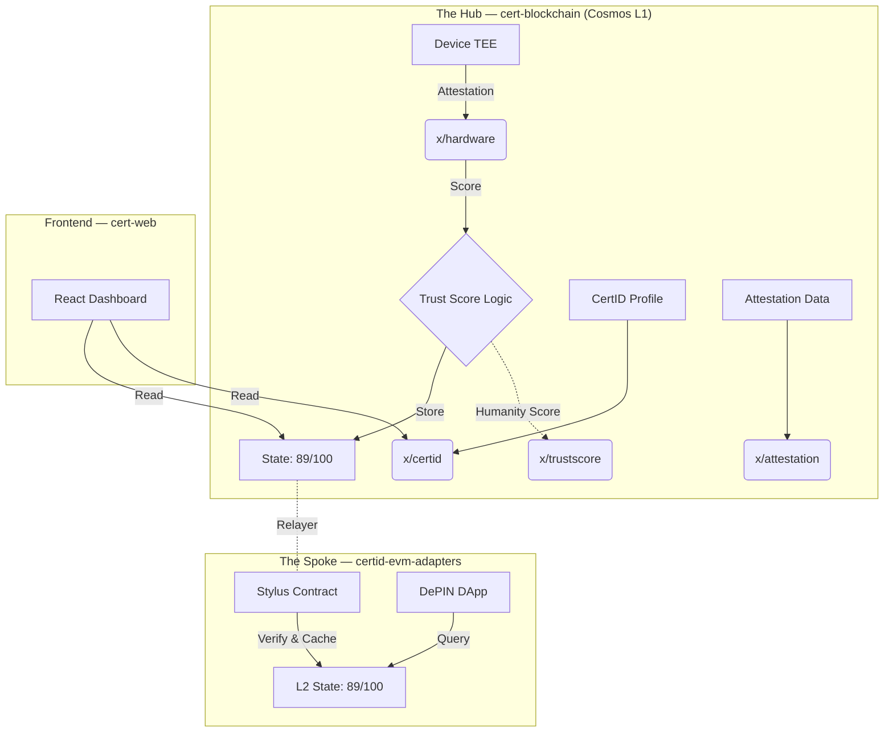

# CERT Blockchain — Sovereign L1 Protocol

The Hub of the CERT Ecosystem: a Cosmos SDK L1 blockchain with EVM compatibility (Ethermint), providing hardware-anchored identity, deterministic trust scoring, and decentralized attestations.

## Architecture



## Modules

| Module | Path | Description |
|--------|------|-------------|
| **hardware** | `x/hardware/` | Device registration, TEE attestation verification, DePIN device trust scoring |
| **trustscore** | `x/trustscore/` | Humanity Score calculation, Sybil resistance, anti-bot scoring |
| **certid** | `x/certid/` | Decentralized Identity (DID) profiles, credential management |
| **attestation** | `x/attestation/` | On-chain attestation creation, EAS-compatible schemas |

## Project Structure

```
cert-blockchain/
├── cmd/
│   ├── certd/              # Chain daemon binary
│   └── api/                # API server binary
├── app/                    # BaseApp wiring, genesis, ante handlers, EVM config
├── x/                      # Cosmos SDK Modules
│   ├── hardware/           # Device & TEE logic
│   ├── trustscore/         # Humanity scoring logic
│   ├── certid/             # DID identity logic
│   └── attestation/        # Attestation logic
├── proto/                  # Protobuf definitions
│   └── cert/
│       ├── hardware/v1/    # Device & attestation protos
│       └── trustscore/v1/  # Scoring protos
├── api/                    # REST API server (handlers, middleware, database)
├── contracts/              # Solidity smart contracts (CertID, EAS, Bridge)
├── sdk/                    # JavaScript/TypeScript SDK (@chaincertify/sdk)
├── services/               # Integration services (also in certid-evm-adapters)
│   ├── attestation-api/    # Encrypted attestation REST API
│   ├── bridge-validator/   # Cross-chain bridge validator
│   └── stylus-verifier/    # Arbitrum Stylus TEE verifier (Rust/WASM)
├── scripts/                # Deployment & utility scripts
├── config/                 # Node configuration (app.toml)
├── test-node/              # Local testnet node config & genesis
├── tests/                  # Integration tests
└── dapps/                  # Example dApps
```

## Related Repositories

| Repository | Purpose |
|------------|---------|
| [certid-evm-adapters](https://github.com/chaincert/certid-evm-adapters) | Arbitrum Stylus verifier, bridge validator, attestation API |
| cert-web | React frontend dashboard (separate deployment) |

## Build

```bash
# Build the certd binary
make build

# Install to $GOPATH/bin
make install

# Run unit tests
make test-unit

# Run all tests
make test

# Build Go packages (verify compilation)
go build ./cmd/... ./app/... ./x/...
```

## Chain Configuration

| Parameter | Value |
|-----------|-------|
| Chain ID (Cosmos) | `cert_4283207343-1` |
| Chain ID (EVM) | `4283207343` |
| Bond Denom | `ucert` |
| Bech32 Prefix | `cert` |
| Go Module | `github.com/chaincertify/certd` |
| JSON-RPC | `http://localhost:8545` |
| CometBFT RPC | `http://localhost:26657` |

## Quick Start

```bash
# Start the node with EVM JSON-RPC enabled
make start
```

## License

See [LICENSE](LICENSE) for details.
